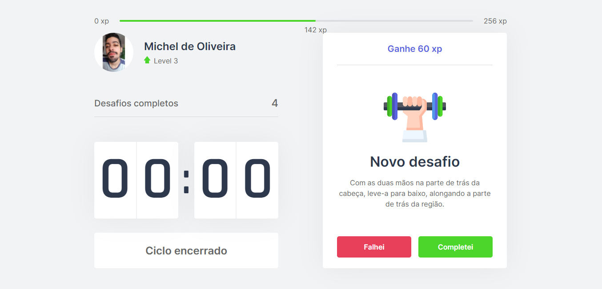

<h1 align="center">
  move.it 🤸‍♂️
</h1>

<div>
  
</div>

  💡 Move.it is a web application focused on helping those who spend a lot of time in front of the computer. Based on the Pomodoro method, Move.it creates 25 minutes time cycles in which the user has to be focused on their task. In the interval of these cycles, the user receives a challenge that consists of a random exercise, which can be for the body or the eyes.

   When the challenge is completed, the user receive one amount of "Experience" that can vary depending on the challenge. If the user's level "xp" goal is reached, the user will level up and acquire an additional challenge for counting complete challenges


  # Techs
  🚀 The project is building with:
  * [ReactJS](https://reactjs.org/)
  * [Next](https://nextjs.org/)
  * [TypeScript](https://www.typescriptlang.org/)

  # Clone this project

 💻 To clone this project on your machine, make sure you have [NodeJS](https://nodejs.org/) and [Yarn](https://yarnpkg.com/) (or [NPM](https://www.npmjs.com/)) previously installed.


  ```bash

  # Clone the project
  $ git clone https://github.com/MichelNascimento/moveit-react.git

  # Go to project folder
  $ cd moveit-next

  # Install the dependencies
  $ yarn

  # Running the application (The application will be accessed at http://localhost:3000 in the browser)
  $ yarn dev

  ```

  # Next steps

 💪 The next features that will be implemented in this application are:

  * Layout improvements (apply responsiveness, change colors, implement the night mode option);
  * Create option to login using GitHub username;
  * Create a ranking of higher scores.